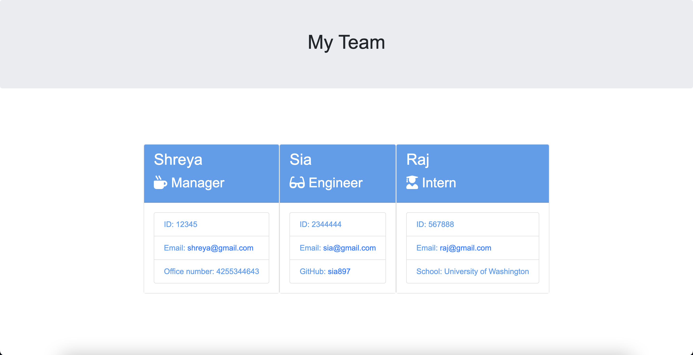

 
  
    Check out the badges hosted by [shields.io](https://shields.io/).
  

## Team Profile Generator  

## Description  
 The application creates a webpage giving information of the team members, like their ID, email etc. The application is created using node js and utilizes jest functionalities for testing purposes.
## Installation   
The user should clone the repository from GitHub and download Node. This application also requires a file system and inquirer module. If testing is required, this application uses Jest.
## Usage  
To help managers save their time by automatically generating webpage to show details of his team.
* Uses the [Inquirer package](https://www.npmjs.com/package/inquirer/v/8.2.4).

* Uses the [Jest package](https://www.npmjs.com/package/jest) for a suite of unit tests.

## Mock-Up

The following image shows a mock-up of the generated HTML’s appearance and functionality:

🎥 The full movie file showing functionality of the application can be found [here](./lib/team_generator_video.mov)  

## License  
MIT
## Contribution   
Shreya Mishra
## Test   
Run npm test to run Jest for tests on constructors.

## Contact Information:
* GitHub Username: shreyamishra9618
* GitHub Email: shreym96@uw.edu

